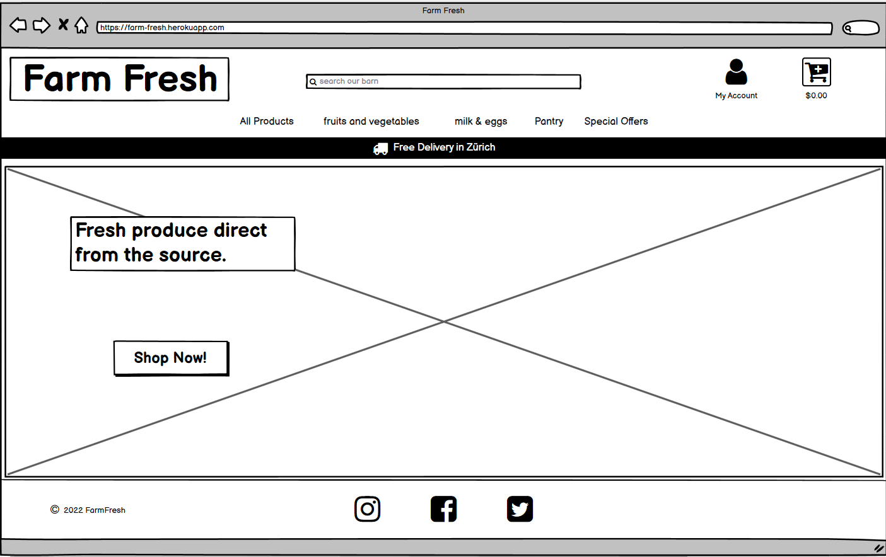
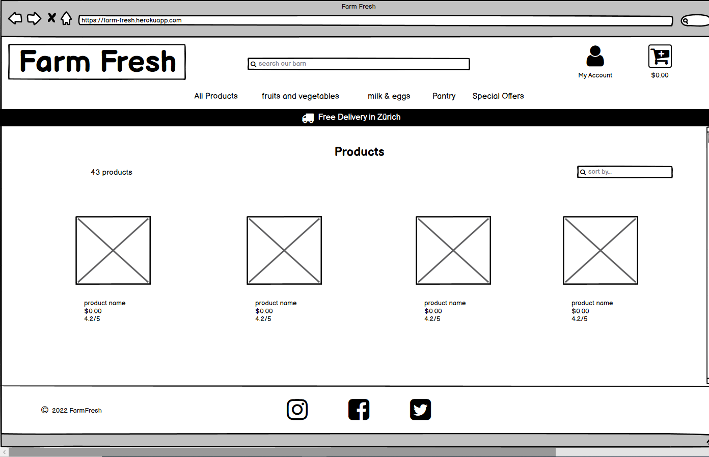
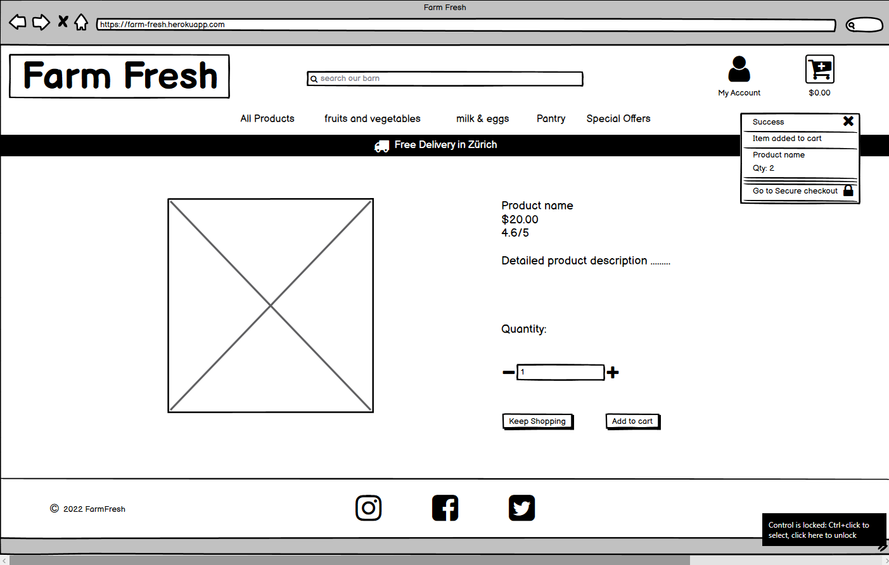
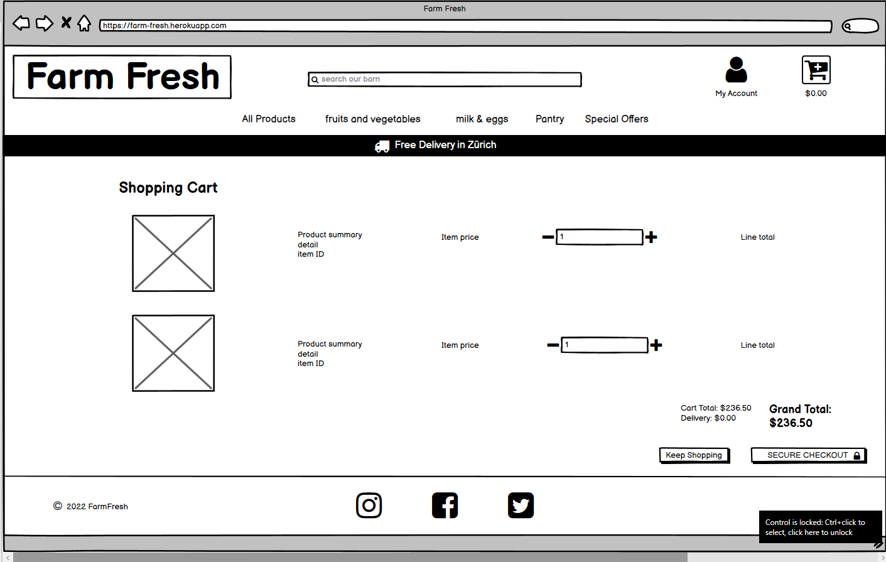
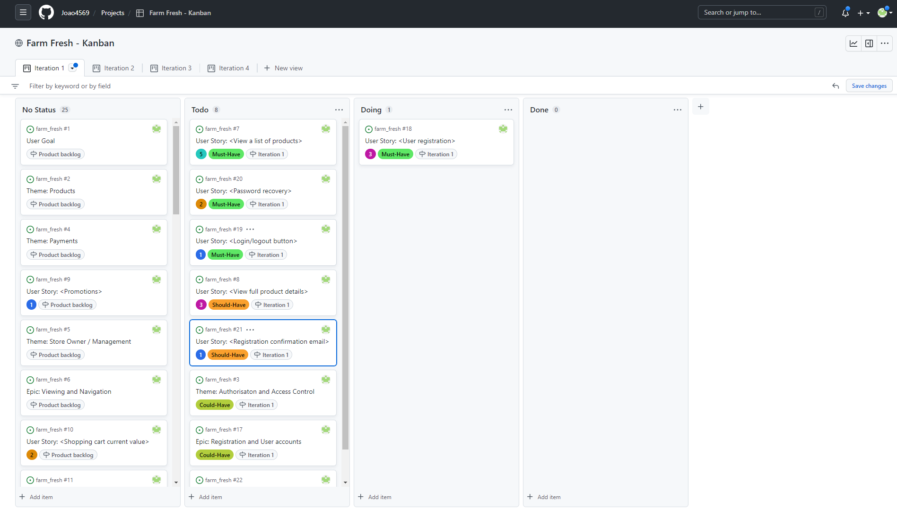
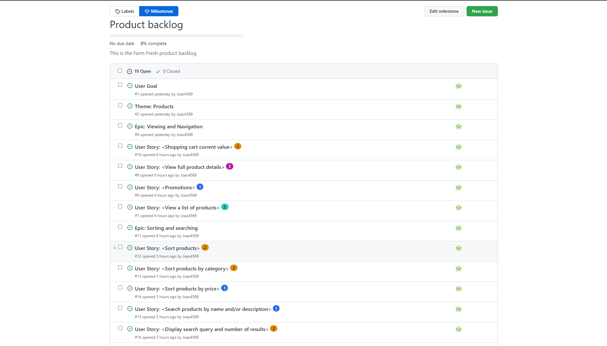
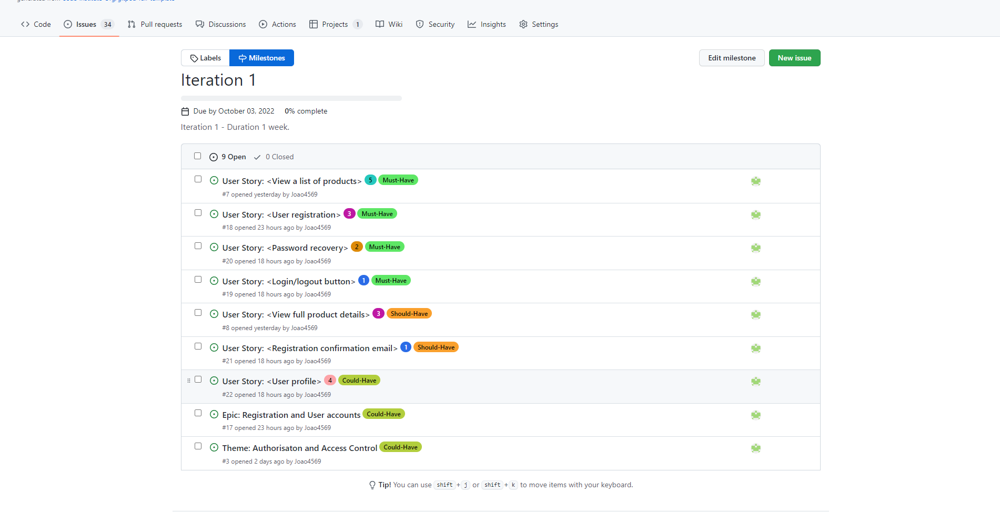
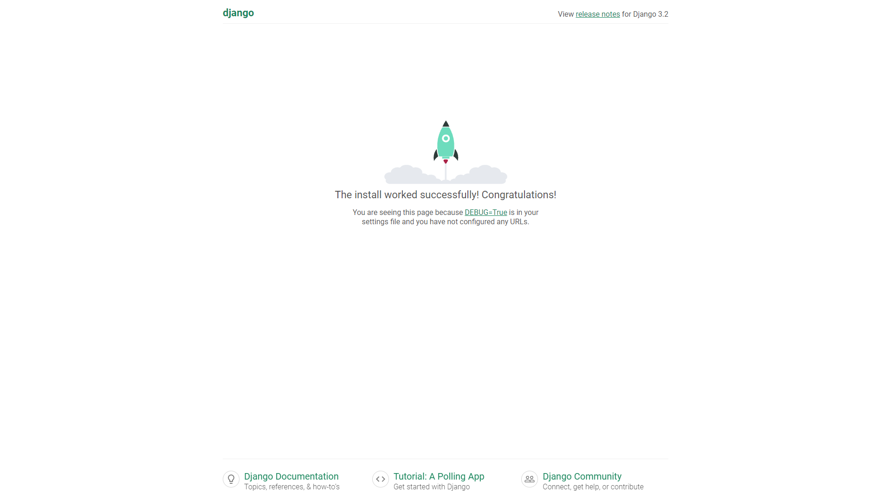

# Farm Fresh

## Introduction

## Table of Contents

* [Conception](#conception)

  * [Project Scope](#project-Scope)

  * [Basic Wireframe Design](#basic-wireframe-design)
    * [Landing Page Wireframe](#landing-page-wireframe)
    * [Products Page Wireframe](#products-page-wireframe)
    * [Product Detail Page Wireframe](#products-detail-page-wireframe)
    * [Shopping Cart Wireframe](#shopping-cart-wireframe)
    * [Checkout Page Wireframe](#checkout-page-wireframe)

  * [Agile](#agile)

* [Project Setup](#Project-Setup)
  * [Installing Django and supporting libraries](#installing-django-and-supporting-libraries)
  * [Create new Django project](#create-new-django-project)
  * [Django Allauth](#django-allauth)
    * [Required Django Allauth settings](#required-django-allauth-settings)

* [Deployment on Heroku](#deployment-on-heroku)
  * [Heroku Deployment - Setting up AWS](#heroku-deployment---setting-up-aws)

* [Access Control](#access-control)

* [Features - Existing Features](#features---existing-features)

  * [Django Apps](#django-apps)
    * [Home App](#home-app)
    * [Product App](#product-app)

    * [Cart App](#cart-app)
      * [Template Tags](#template-tags)
      * [Context Processor](#context-processor)

    * [Checkout App](#checkout-app)

* [MVT Architecture](#mvt-architecture)

  * [Models](#models)
    * [Products](#products)
      * [Category Model](#category-model)
      * [Product Model](#product-model)
      * [Producer Model](#producer-model)

  * [Views](#views)
    * [Index View](#index-view)
    * [All Products View](#all-products-view)
    * [Add to Cart View](#add-to-cart-view)

  * [Templates](#templates)
    * [Allauth Templates](#allauth-templates)

    * [Base Template](#base-template)
      * [Includes](#includes)
        * [Mobile Top Header](#mobile-top-header)
        * [Mobile Navigation](#main-navigation)

    * [Products Template](#products-template)
    * [Product Detail Template](#product-detail-template)
    * [Toasts](#toasts)
    * [404 Errors](#404-errors)
    * [Products Template](#products-template)
    * [Product Detail](#product-detail-template)
    * [Checkout Template](#checkout-template)
    * [Checkout Success Template](#checkout-success-template)
    * [Profile Template](#profile-template)

* [Web Marketing](#web-marketing)

* [SEO Optimization](#seo-optimization)

* [Features - Features Left To Implement](#features-left-to-implement)

* [Testing](#testing)
  * [Manual Testing](#manual-testing)
  * [Stripe Testing](#stripe-testing)
  * [Deployment Testing](#deployment-testing)
  * [Validator Testing](#validator-testing)
  * [Bugs Found](#bugs-found)
  * [Unfixed Bugs](#unfixed-bugs)

* [Credits](#credits)
  * [Content](#content)
  * [Media](#media)

# Conception

My thinking was that given the requirements of the project, it would be very beneficial to formulate some kind of plan which would lay out the basic scope and design of my project in order to have some kind of structure with which to work with in order to avoid missing any crucial steps during construction and make the whole construction process as efficient as possible.

I made use of the following resources in order to plan and visualise my project, named Farm Fresh:
 - I made use of [Lucidchart](https://www.lucidchart.com/pages/) to design flowcharts in order to visualise the scope of my ideas and thought processes.
 - I also made use [Lucidchart](https://www.lucidchart.com/pages/) to plan my use of Agile methodology and common practices, taught to me by Code Institute.
 - [Lucidchart](https://www.lucidchart.com/pages/) has a ERD diagram template which I used to plan Ocean Basket's model.
 - I made use of [Balsamiq](https://balsamiq.com/) in order to create a basic wireframe design for Ocean Basket's webpages.

### Project Scope

### Basic Wireframe Design

Once I had the basic scope and logic in place, I then proceeded to design a visual representation of what is needed for the basic functionality of the project from a user's point of view and how I would represent that.

#### Landing Page Wireframe

#### Products Page Wireframe

#### Products Detail Page Wireframe

#### Shopping Cart Wireframe

#### Checkout Page Wireframe

### Agile

I made use of agile common practises as described in the Code Institute tutorials. I did my best to come up with a complete layout of my agile plan from the get go but will make decisions in logical stages and update my diagrams and processes as the project develops, while documenting everything as the build progressed.

This is how I approached the challenge:

1. After reading the project requirements and the User's goal for the project idea that I had selected, I came up with the project's user goal, themes and epics.
2. From the epic's I derived the various user stories and built on this as the project developed.
3. Once I had created some user stories, I then came up with the relevant tasks for each user story.
4. After creating some stucture and scope for how to approach the task at hand, I started recording all my processes on Github:
    - I created user story templates on Github for efficiency in the Agile process.
    - I made use of Github issues to create and manage my user stories and for future defects if they arise.
    - I also came up with user story acceptance criteria which I added to the user stories as comments on Github issues.
    - I allocated each user story with user story points, just as good practice.
    - A product backlog was also created using Github milestones, and managed throughout the development of the project in order to structure my development process.
    - As the build developed I would make refinements to the backlog.
    - I also created an iteration milestones on Github projects for use in this project as a timebox.
    - I made use of MoSCow prioritization by creating labels on Github and allocating them to the relevant user stories.
    - I also tried to keep balance of 60% Must have's, 20% Should have's and 20% Could have's for each iteration.
    - I created a Kanban board for use as an information radiator in this project by using "projects" on Github.

#### Kanban Example

#### Product Backlog Example

#### Moscow Prioritisation Example

# Project Setup

After completing the basic conception of my idea and designing some basic structure to it, I then proceeded to setting up my IDE for the project using the steps recommended by Code Institute, namely:
1. Install Django
2. Create new Django project
3. Install Django Allauth
4. Create a `requirements.txt` file
5. Create a directory for storing all of the required and customised Django allauth templates.
6. Create the MVT Architecture for Farm Fresh.

### Worth Noting:

#### Installing Django and supporting libraries

1. I installed Django version 3.2 which is the Long Term Support version of Django and recommended by Code Institute for the use on our projects.
**Note** - I changed the version of Django from 3.2 to 3.0.1 as I was having issues logging in to the admin site after installing Django allauth version 0.41.0. The Code institute tutorial specified to install Django 3.2 with Django allauth 0.41.0 but in the requirements.txt file for the tutorial it is specified as Django 3.0.1 and this resolved my issues.

#### Create new Django project

1. Create new blank Django project and name it farm_fresh.
2. Migrate changes to database after creating the project
3. Test if project is working correctly.

#### Django Allauth

Opposed to building my own authentication system, allauth already has all the features I'll need for the site and it's completely customizable and will allow me to add even more functionality later on. Additionally, it's open-source so it's backed by millions of developers who keep it secure and up-to-date and it's unlikely that I would be able to create something better without a ton of extra development time.

##### Required Django Allauth settings

1. The request context processor, `'django.template.context_processors.request'`, allows allauth and django itself to access the HTTP request object in the templates, i.e. to access request.user or request.user.email in the django templates. It's required because the allauth templates use the request object frequently.
2. The authentication backend, `'allauth.account.auth_backends.AuthenticationBackend'`, in the setting.py file of the Farm Fresh project allows users to log into the store via their email address.
3. The other back-end, `'django.contrib.auth.backends.ModelBackend'` handles superusers logging into the admin which allauth doesn't handle. So I deferred to the default django Code for that.
4. The apps I added to the installed apps in the setting.py file of the Farm Fresh project, are allauth itself and these two: `'allauth.account'`, which is the allauth app that allows all the basic user account functionality like logging in and out, user registration and password resets. `'allauth.socialaccount'` which specifically handles logging in via social media providers like Facebook and Google.
5. The contrib.sites app and the site _id setting I added to the setting.py file of the Farm Fresh project, are used by the social account app to create the proper callback URLs when connecting via social media accounts.
6. I also created a path called accounts in the project level `urls.py` file and used it to include all the Django Allauth urls. I did this manually to keep everything consistent with the version of django that I have used.
7. In settings.py I added The `ACCOUNT_AUTHENTICATION_METHOD = username_email` this is what tells allauth that we want to allow authentication using either usernames or emails.
8. In settings.py, by setting `ACCOUNT_EMAIL_REQUIRED` to `True`, `ACCOUNT_EMAIL_VERIFICATION` to `mandatory` and `ACCOUNT_SIGNUP_EMAIL_ENTER_TWICE` to `True`, make it so that an email is required to register for the site. Verifying your email is mandatory so we know users are using a real email and they're going to be required to enter their email twice on the registration page to make sure that they haven't made any typos.
9. I also set a minimum username length of four characters and specified a login url and a url to redirect back to after logging in.
10. Finally create a allauth directory within the project level templates directory in order to store the customised allauth templates.

# Deployment on Heroku

These are the steps I followed in order to get Farm Fresh deployed on Heroku, as explained and taught to me in the Boutique Ado walkthrough project.

1. Firstly I created a Heroku app within Heroku.
2. Then I provisioned a Postgres database on Heroku.
3. In order to use the Postgres database I installed dj_database_url and psycopg2.
4. Froze and updated my `requirements.txt` file in order to make sure Heroku installs all the apps requirements when it is deployed.
5. I then imported dj_databse_url into settings.py and commented out the default configuration and replaced the default database with a call to `dj_database_url.parse` and gave it the database URL from Heroku. Which one can get from the config variables in the Heroku app settings page.
6. I then proceeded to run migrations for the new Postgres database.
7. As the products model data was the only crucial data that I needed, I created the `products.json` file with data dumped from the SQLite database and loaded it into the new Postgres database on Heroku.
8. I then created a new superuser as there would be no users on the new database models, in order to stil be able to access the Django admin site.
9. I then removed the Heroku database configuration and uncommented the original settings so that the database URL doesn't end up in version control.
10. I made use of an if statement in settings.py, database setup, so that when Farm Fresh is running on Heroku where the database URL environment variable will be defined, it is possible to work on either database depending on future requirements.
11. Then I needed to install gunicorn, which will act as the webserver and froze that into the requirements file.
12. I created a Procfile in order to tell Heroku to create a web dyno which will run gunicorn and serve our Django app.
13. I temporarily disabled collectstatic by using Heroku configuration settings and set disable collectstatic equals 1 so that Heroku won't try to collect static files when I deploy.
14. I then added the hostname of the Heroku app to `ALLOWED_HOSTS` in settings.py and also added localhost in there so that gitpod would still work too.
15. I then push my changes and attempted the initial deployment on Heroku.
16. I removed the secret key from our settings and generated a key and added it to my config variables in Heroku which will be the key for the Heroku app and did the same for Gitpod in my user settings tab.
17. I replaced the secret key setting with the call to get it from the environment and used an empty string as a default.
18. I then also set debug to be True only if there's a variable called DEVELOPMENT in the environment.

## Heroku Deployment - Setting up AWS

I made use of Amazons Web Services S3 as the cloud based storage service for storing Farm Fresh's static and media files.

19. I logged into my AWS account and opened S3 and created a new bucket which will be used to store our files.
20. I unchecked block all public access and acknowledged that the bucket will be public and finalised the buckets creation.
21. Once the bucket was created I set a few basic settings on our new bucket, on the properties tab I turned on static website hosting which will give me a new endpoint that I can use to access it from the internet.
22. Within the permissions settings I pasted in thea coors configuration provided by Code Institute which is going to set up the required access between the Heroku app and this S3 bucket.
23. Next in the bucket policy section I accessed the policy generator in order to create a security policy for the bucket.
24. The policy type was set to be a S3 bucket policy and allowed all principals and the action was set to get object.
25. Next I copied the ARN which stands for Amazon resource name and pasted it into the ARN box and proceeded to add the statement and generated a policy.
26. I then copied this policy into the bucket policy editor and added a slash star onto the end of the resource key to allow access to all resources in this bucket.
27. I proceeded to the access control list section and set the list objects permission for everyone under the Public Access section.
28. 

# Access Control

I have created a few users which will be helpfull for testing the project:

**Superuser**

I created a Superuser in order to access the admin functions of Django. The Superuser is also what I use to create employees, as it is now a new employee can register his or her self the same way as a customer and with the Superuser logged in, one can allocate the "is Staff" property on the admin site.

 Credentials:
   - Username: **FarmFresh**
   - Email: **joaorodrigues1@gmx.de**
   - Password: **Produce45** (case sensitive)

# Features - Existing Features

## Django Apps

### Home App

- contains the home page for Farm Fresh as index.html
- Contains the [index view](#index-view) which will display the home/landing page to the user.

### Product App

This app conatins everything needed for Farm Fresh's products, like the product models, views and URL's.

### Cart App

#### Template Tags

  - A useful trick to have in your arsenal.
For this column, the subtotal should be the quantity times the product price.
In a new folder called template tags.
I'll create a file called bag_tools.py
And I'll also create an empty file called `__init__ .py`
which will ensure that this directory is treated as a Python package
making our bag tools module available for imports and to use in templates.
Now in the bag tools file from django i'll import template.
And then create a function called calc_subtotal
Which takes in a price and a quantity as parameters and simply returns their irproduct.
Now to register this filter we need to create a variable called register.
Which is an instance of template.library
And then use the register filter decorator to register our function as a template filter.
All of this is straight from the django documentation by the way
so if you'd like a deeper explanation of how it works
just go there and look up creating custom template tags and filters.
With the filter finished all we need to do to use it is load it in the bag template with load bag tools.
Then we can pipe the price into it as the first argument.
And send the item quantity as the second.

#### Context Processor

This is Farm fresh's context processor for the shopping cart and its purpose is to make a dictionary available to all templates across the entire application much like you can use `request.user` in any template, due to the presence of the built-in request context processor.

In order to make this context processor available to the entire application I added it to the list of context processors in the templates variable in settings.py
This simple change means that anytime we need to access the cart contents in any template across the entire site they'll be available to us without having to return them from a whole bunch of different views across different apps.

Within this context processor, for convenience to the user, to let the user know how much more they need to spend in order to get a free delivery by creating a variable called `free_delivery_delta`. This way we'll be able to entice the users across the site by letting them know that they can get a free delivery if they just buy a couple more items.

#### checkout app

- Crispy  forms
- settings.py built-ins

# MVT Architecture

## Models

### Products

### Category Model

This model contains the information for product categories such as it's related attributes and model methods. This model is related to the Product model and only contains the information for a category's programmatic name and an easier to read and use, friendly name..

### Product Model

This model contains all the information for each product such as it's name, description, price, image and other related attributes such as if a product is in season or organic.

### Producer Model

This model contains all the information for each producer such as there name, description and an image.

## Views

### Index view

This view acts as the home/landing page for users.

### All Products view

This view acts as the main products page for Farm Fresh. It also contains the neccessary code in order for the search bar functionality to function.

**Worth Noting**

- The object Q was imported and used in this view to generate a search query. In Django if you use `product.objects.filter()` in order to filter a list of products, like I did in this view, everything will be ended together. In the case of our queries, when a user submits a query, in order for it to match the search term it would have to appear in both the product name and the product description. Instead I wanted to return results where the query is matched in either the product name or the description. In order to accomplish this "or" logic, I needed to use Q.

 - Example of code :
   `queries = Q(name__icontains=query) | Q(description__icontains=query)`
   `products = products.filter(queries)`

 - By setting a `queries` variable equal to a Q object, where the product name contains the query or the product description contains the query, the pipe here then generates the "or" statement and the `i` in front of `contains` makes the queries case insensitive. With those queries constructed one can pass them to the filter method in order to actually filter the products.

### Add to cart view

In modern versions of HTTP every request-response cycle between the server and the client, in my case between the django view on the server-side and our form making the request on the client-side. Uses what's called a session, to allow information to be stored until the client and server are done communicating. This is especially handy in a situation like an e-commerce store.

Because it allows us to store the contents of the shopping cart in the HTTP session while the user browses the site and adds items to be purchased.By storing the shopping bag in the session. It will persist until the user closes their browser so that they can add something to the cart. Then browse to a different part of the site add something else and so on without losing the contents of their cart. I created this view to implement this concept.

 So for a brief review:

 - The user submits the form to this view including the product id and the quantity.
 - Once in the view we'll get the cart variable if it exists in the session or create it if it doesn't.
 - Finally the item gets added to the cart or the quantity gets updated if it already exists and then the variable in the session gets overwritten with the updated  version.

## Templates

All templates folders for apps were created with inner directories matching the apps names to make sure that django knows which app these templates belong to, in case any of them end up having the same names as other templates.

### Allauth templates

All allauth templates were copied and stored in a unique directory within the project level templates directory in order to store and customise all the required allauth templates for Farm Fresh.

All Allauth templates that are in the account folder have been customised for use on Farm Fresh.

### Base Template

This will act as the main base from which most other templates will be based on, containing the main generic content and styling for Farm Fresh. Recommended best practises taken from Boutique Ado walkthrough project.

Contains the following:

  - Seperate blocks were created so that I can extend this template later on and replace segments of it as needed.
  - I incorporated the use of a `http-equiv` meta tag to allow the support of older Internet Explorer versions and eliminate validation errors when validating our HTML.
  - All the relevant script tags needed to run Bootstrap version 4.6.
  - All the secmented sections of blocks so that I can extend this template later on and replace segments of it as needed.
  - Link to it's CSS file for styling.
  - The sites main header with logo, search bar, user related links and the link to the shopping cart.
  - The search bar has the functionality to search for terms in either the products name or its description.
  - The delivery banner and navigation bar structure.
  - Code for displaying messages from Django by means of [toasts](#toasts).

### Includes

This is commonly found in larger web projects, this gives us a place where we can create small HTML snippets and then include them in the base template using Django.

#### Mobile Top Header

This include will act as the top header for smaller mobile devices that access the site.

The list items used here are almost identical to the ones that exist in the header in `base.html` except for a few key things:
 - First you'll notice that the links in them each use the d-block and the d-lg none classes from bootstrap. This way they'll be hidden on large screens where      instead they'll show up in the top portion of the header.
 - Secondly the search form is now in a drop-down menu, instead of creating a list of links like I did for the My Account drop-down, I put a form in it instead.

Contains the following:

  - Button for accessing the search bar.
  - Button for opening my account menu dropdown menu.
  - Button for access to the shopping cart displaying it's current value.

All of this makes sure that the top portion of the navbar which is separate from the main navigation will display cleanly on mobile and give the user a much better UX.

#### Main Navigation

This include will act as the main navigation of each page of Farm Fresh.

Contains the following:

  - The all products navigation dropdown menu.
  - The fruit and veg navigation dropdown menu.
  - The milk and eggs navigation dropdown menu.
  - The pantry navigation dropdown menu.
  - The special offers navigation dropdown menu.

### Toasts

To add to the overall user experience on the site I added a feature of bootstrap called toasts, which will give us some nice clean notifications that we can customize. This will use the Django messages framework to communicate with our users as they use our store.

Contains the following:

  - Each toast consists of a header, body and a close button.
  - The success toast additinally contains code for displaying a summary of the users shopping cart, for review by the user, if items have been added to the cart.
  - The success toast also contains a link for the user to go to there shopping cart for a more detailed view.

### 404 Errors

This template will render a custom 404 error message to users when they try and access pages that do not exist for a better UX when navigating this site.

### Products Template

This template extends the base template and allows the user to view lists of products including some details of the products, their prices and product images. The superuser will be able to edit or delete inventory items if logged in on this page.

Contains the following:

 - An overlay to cover the background image for a cleaner look and feel to the user.
 - Sorting functionality so that the user my sort products by price, name or category.
 - A product counter to show the user the number of products on the page for a better UX.
 - The logic for how to display the products for various screen sizes giving the user the best possible UX.
 - A button to return to the top of the screen, also for a good UX.
 - The Javascript for the return to top button and the sorting functionality.

### Product Detail Template

This template will provide the user with a detailed view of the selected product with a full product description. The superuser will be able to edit or delete inventory items if logged in on this page.

Contains the following:

- A CSRF Token used in form in order to take advantage of Django's cross-site request forgery protection. As a security precaution without this token Django won't allow you to submit the form.
- A bigger product image.
- A product description.
- A quantity selector.
- Keep shopping and add to cart buttons.

### Checkout Template

This will act as the template for finalizing a order and processing a payment.

Contains the following:

- A order summary view with product count and order price totals.
- A form for the user to input their delivery and payment information.
- A button for going back to the cart and amending the order.

### Checkout Success Template

### Profile Template

This template will act as a page for the user to view and update there delivery information and view their order history.

Contains the following:

- A form for viewing the users delivery information.
- A button for updating their information.
- A view of their order history.
- A link to view previous orders by clicking on the displayed order number.

### Web Marketing

Web marketing is the process of marketing a business online, and it's a cost-effective way to reach people who are most interested in what your business has to offer.

I chose to make use of [SEO optimization](#seo-optimization), social media marketing by means of organic growth as well as email marketing by means of a newsletter which users can sign up to.

I believe the benefits of doing this will be:

  - Making Farm Fresh optimized for Google searches
  - Build brand identity
  - Ability to connect with customers
  - Ability to build relationships and loyalty with our audience
  - Improve customer service
  - Ability to share content that will attract relevent customers
  - Content can be shared by cutomers to new potential customers
  - Quick and easy to setup
  - A low cost to the new business
  - Easy scalability
  - Increase sales

### SEO Optimization

My first step in keyword research was to make a list of important, relevant topics, based on what I know about the  business behind this web application.
  
I tried to put myself in the shoes of my potential customers and thought about their possible personas in order to think about the general topics that I would want to rank highly for.

I tried my ideas out on Google and took note of the relevant suggestions it gave me in return. Google search itself was an excellent tool for getting a feel for which keywords are popular, or what common questions come up for users searching on similar topics.

The “People also ask” and “Related searches” sections on the google results page gave me examples of popular searches on similar topics to the one's that I entered in my own search.  

These were extremely valuable, because they are almost always in the form of those all important long-tail keyword phrases. I did my best to filter out keywords with a high volume and a low competition.

I made use of the best semantic layouts and best practices that I could throughout the site in order to have a good start for SEO optimization.

I then proceeded to search, research and filter my results in order to make up a final list of short tail and long tail keywords for use in Farm Fresh.

Next I then created a xml sitemap. A sitemap file ensures search engines will crawl every essential page on Farm Fresh.

1. I implemented meta tags with a description of Farm Fresh and keywords that i found to be usefull.
2. I made use of some strong tags and changed some of the text on templates to better suite my selected keywords.
3. Throughout the production of this application I made use of some things to better optimize the site for Googles search engine:
  - I made use of good semantics.
  - I ensured that my image names were custom to the subject of the image for a better `alt` attribute on my templates.
  - And by ensuring that the content of the site matches its purpose.
4. I created a `sitemap.xml` file in order to list Farm Fresh's important page urls, making sure that search engines can crawl, or navigate,  
through them and also help search engines understand the website structure which can help speed up content discovery for search engines when they crawl and index this web application.
5. I also created a `robots.txt` file in order to tell search engines where they are not allowed to go on a website. It lists out any folders or files that will not be crawled or indexed by search engine spiders. Having a robots.txt file shows that you acknowledge that search engines are allowed on your site and that they may have free access to it. For this reason, search engines take the existence of this file in this project as a sign of quality and improve Farm Fresh's SEO ranking.
  - The file contains disallows for the following:
   - Accounts
   - Cart App
   - Checkout App
   - Sitemap

# Features Left To Implement

# Testing

## Manual Testing

- After creating the `farm_fresh` project in Gitpod, I tested it buy running the application and recieved visual confirmation that the application is working successfully from Django.

- After installing Django allauth, I manually tested logging in and out of the admin site. I found some issues but they are now all resolved and noted in the Bugs found section of this document.

- After finalising the Django allauth installation I manually went to the accounts login page and tested the authentication by redirecting a successfull login to a "success" url (which does not exist) and confirmed that it is working as expected.

- After creating the home app and index.html template with its associated view and urls, I manually tested that the template was working correctly.

- With each template created, I would manually test that they are working and displaying as intended.

- Once the initial basic products.html view was created I manually did a test to see if the context, containing products and their attributes were displaying as i expected, confirming that the views, URL's and and templates are all working as planned.

- After creating the product detail tamplate, I manually tested that all links to individual products and product images worked and that the shop now button worked as intended. All worked as expected but I found a bug, on a small mobile device the empty header container wasn't pushing the top of the page down to the bottom of the main site header, the bug and fix is recorded as bug number 4 in the [Bugs found section](#bugs-found).

- Once the logic was in place for the search bar functionality, I manually tested it by running multiple search queries with search terms that were either in the products names or descriptions and checking the results. I did not find an error with this and it is working as expected.

- After creating the shopping cart view, it's URL's and template, I then set up the links in the base.html template as well as the mobile top header template, ran the server and tested that all the links were working as planned.

- After completing the add to cart view, In order to test its functionality, I printed the shopping cart from the session in the add to cart view. By adding a couple products to the cart and checking the console I could see each products id and the quantity added.

- After adding the increment and decrementing buttons to the various pages, I manually tested and adjusted their operation for the desired functionality.

- Throughout the process of creating the shopping cart, the buttons for quantity adjustment of a product and the links for updating and removing items from the shopping cart, I extensively tested for the expected functionality and found all buttons, links and pricing functioned as I had envisioned.

- After creating the success toast, I manually added a product to the cart and tested its operation. It worked as expected.
 - Once the logic for different toasts allocated to different levels was in place, I also tested its functiionality by creating various toast allocations using my views in order to test its operation. All worked successfully.

- While checking the checkout flow by adding items to the cart, processing a test checkout payment, checking that the form is submitted and testing that the checkout_success page was working as expected, I found that the costs for the order did not appear in the order on the admin site, I suspected that the signals were not working as intended. The bug and it's fix is recorded as bug no. 5 in the [Bugs found section](#bugs-found).

- I did a test log in and logout and found that the standard Allauth templates did not function well and started with their customisation thereafter.

- Once all the Allauth templates were customised, I then proceeded to test login, logout and registration by creating a new user. At the same time I also tested that the confirmation emails were functioning. I had to temporary block out the signal for the model function of the UserProfile model in order to log in with the superuser as it was created prior to the signal, this was to avoid it giving an error and to avoid having to create a new superuser. All tests were successfull.

- Once the functionality was in place for users to update their profile with new information, I tested it for the expected functionality and found it all to be in order.

- Once all the functionality was in place to test the order history and if user information is saved, if so selected by the user, I then proceeded to place an order as a authenticated user, process a test payment with test information to update the test users information. All functioned as expected and the order history is diplayed and the users information was updated and stored.

 - I also tested the order history link by clicking on the order number on the profile pages order history section and was redirected to the information of the specific order.

- Once everything was in place for the users information to be pre-filled on an order if they have the neccessary information saved, I then proceeded to test this by creating a new order and checking that the users info was in place as expected. All was in order.

- After adding the functionality to the webhook handler of the checkout app, to handle the form submision if for some reason the checkout view fails, I adjusted the Javascipt not to submit the form and tested if the webhook handler performed as expected. I found all to be in order and functioning as intended. The users order history also updated and got saved to the users profile.

- After initially creating the add product form and view, I tested its operation buy adding the url, going to the page and testing all fields. All tested well and as expected.

- I then proceeded to add product, with and without images and found that the add product functionality is working exactly as expected.

- Once all product admin functions and links were in place, I then proceeded to add, edit and delete products and found that all CRUD functionality and links were working as expected.

- When I completed the new style image field in the product admin section, I tested it by adding and editing a new test product while adding an image, removing it and changing it, and found that all was functioning as expected.

- Access control to all product admin pages was tested and functioning as expected. As a non-superuser one cannot access these pages and will be notified with an errror message displayed on screen.

- After doing some refactoring I found a bug with the cart template. I refactored the code by extracing sections of code and made use of Djangos template syntax in order to add the code to cart.html by means of includes, once this was done the cart page would not display and continuously gave errors. recorded as bug no. 11 in the [Bugs found section](#bugs-found).

## Stripe Testing

When entering an invalid card number, the numbers change to red indicating an invalid card number.

After initial installation I used the Stripe test card number and processed a payment, the form submitted and the payment was shown as successfull on the Stripe site.

## Deployment Testing

- Once our AWS bucket was created and the the new storage location setup for our static files, I ran a deployment and found that it was not working as expected. This is listed as bug no. 7 in the [Bugs found section](#bugs-found).

- While trying to deploy to Heroku I found an error pertaining to `backports.zoneinfo` not being able to build its wheels during deployment. I sourced a fix for this and it is listed as bug no. 9in the [Bugs found section](#bugs-found).

- While testing if images were displaying on the deployed site I found a bug with the image URL's. This is now fixed and noted as bug no.8 in the [Bugs found section](#bugs-found).

- Once all bugs found thus far had been attended to, I then proceeded to test all images, shopping cart functions and checkout functionailty by logging in and compiling an order, then processing a payment and viewing the test users order history and found the purchase, checkout and Stripe functionality all working as expected on the deployed site.

- After setting up a functioning email service, I proceeded to create a test user with a temporary email address and registered on the site. I recieved an email with a confirmation link and found everything working as expected.

- While testing for mobile devices UX, I found 2 minor bugs which were easily fixed. Noted as bug no. 10 in the [Bugs found section](#bugs-found).

**Image Placeholder**

## Validator Testing

- I Made use of the official [(Jigsaw) validator](https://jigsaw.w3.org/css-validator/) for the CSS file and the official [W3C validator](https://validator.w3.org/) for all HTML file testing.
- I made use of [PEP8 online checker](http://pep8online.com/) to validate all python code.

HTML code passes through the official W3C validator with no issues
CSS code passes through the official (Jigsaw) validator with no issues
JavaScript code passes through a linter (e.g. jslint.com) with no significant issues
Python code is consistent in style and conforms to the PEP8 style guide (or another explicitly mentioned style guide, such as Google's)

# Bugs found

1. While testing Django allauth I found that I did not have a matching Django and Django allauth versions in order to proceed with the project as I was taught - **RESOLVED** by uninstalling Django 3.2 and installing Django 3.0.1, then creating a new SuperUser.

2. While testing Django allauth I found this error in the terminal window: `TypeError: argument of type 'PosixPath' is not iterable`, I found a solution to the issue on [Stackoverflow](https://stackoverflow.com/questions/64634674/django-typeerror-argument-of-type-posixpath-is-not-iterable) by making use of the `os.path.join()` method on the default database name value.

3. While creating the products models and attempting to make migrations I recieved the following error from the terminla window : `(fields.E210) Cannot use ImageField because Pillow is not installed.` - **RESOLVED** by installing Pillow.

4. While testing the product detail template I found that on a small mobile device the empty header container wasn't pushing the top of the page down to the bottom of the main site header - **RESOLVED** by adding another 3 media queries in the base.css file in order to push the body down on mobile devies due to the slightly different layout used.

5. Found a bug with the checkout signals while testing the checkout flow - first I found a duplicate function name in signals.py within the checkout app, I changed this and added a print message in order to test the delete signal in the update on delete function.**RESOLVED** by finding that the signal was recieved, printed my message to the terminal and updated the orders totals. Just to make sure I then created and deleted another order, updated and modified a few line items and found it all was working as expected, including the delivery costs while I was busy testing the rest of the functionality.

6. While testing the checkout success page and the Stripe webhooks, I found an error with the form submit function in the stripe_elements.js file. I was trying to trim and collect form data which is preset in the model as well as non editable fields, and not captured on the form from the users input. **RESOLVED** by removing the code for collecting and trimming the users form input, for these 3 field: City, Country and state.

7. While testing if the static files were being loaded to our AWS S3 bucket, an error appeared that our static files were not being loaded to AWS. Since I was using the Boutique Ado project as a guiudeline for this project, I opened the requirements.txt file and compared it to my own as I thought the error might lie with the relationship between older versions of certain software trying to communicate with newer versions of others. I proceeded to then uninstall and reinstall any versions of software that looked like they were a lot newer than once used in Boutique Ado and this **RESOLVED** the issue and all my static files were loaded to our AWS bucket.

8. After testing if all images were displaying after having been moved to AWS, I found that non of the images were displaying. I **RESOLVED** this by fixing all the image source URL's by using newly setup media url instead of the normal `/media/` file path used in gitpod throughout production.

9. While deploying to Heroku I found an error with the deployment, the standard Heroku Python runtime version is not compatible with the setup of this application. I **RESOLVED** this by creating a `runtime.txt` file containing a runtime Python version to be used by Heroku. The source of this solution is listed in the Credits [content](#content) section of this document.

10. While testing deployment for mobile devices I found 2 minor bugs, the first was a naming convention that I forgot to change while building and the other I found when trying to access the shopping cart. I recieved a 500 error (Internal server error) and managed to trace it bag to either views.py, urls.py or in cart.html file for the checkout app. While checking cart.html for errors, I realised that when creating the new includes for this page, that I had made an error with one of the includes names. This is now **RESOLVED**.

11. After refactoring code in cart.html, by extracting code blocks and making use of includes within cart.html, I continuously had errors and the page would not display. I posted the issue on Slack and consulted with my mentor but as far as we can see my includes were done correctly and the source of this bug is still a mystery to me. I **RESOLVED** this by reverting the code from cart.html to how it was prior to refactoring and removed the new files that I had created for the includes and the cart page is now working as it should.

# Unfixed Bugs

None that I am aware of.

# Credits

## Media

- All flowcharts and ERD diagrams used in this project were designed by making use of [Lucidchart.com](https://www.lucidchart.com/).
- All wireframes used in this project were designed by making use of [Balsamiq.com](https://balsamiq.com/).
- Background image and all producer images used in Farm Fresh were sourced and taken from [Unsplash.com](https://unsplash.com/).
- All image files that needed to be compressed were compressed by using [TinyPNG.com](https://tinypng.com/).
- Icons used on Farm Fresh taken from [Font Awesome](https://fontawesome.com/).
- Icon class for centering Font Awesome icons taken from [Bulma CSS Framework](https://bulma.io/documentation/elements/icon/), as suggested in the Boutique Ado walkthrough project.
- All product images sourced and taken from [Farmy.ch](https://www.farmy.ch/).

## Content

 - I learned how to use `inline code blocks` in a Markdown file on [RIP Tutorial](https://riptutorial.com/markdown/example/1802/inline-code).
 - Git commit message best practices taken from [How to Write Good Commit Messages: A Practical Git Guide](https://www.freecodecamp.org/news/writing-good-commit-messages-a-practical-guide/)
 - I made extensive use of Code Institute's learning content and tutorials throughout the project for revision as well as usefull content for my readme file.
 - I made extensive use of the Django Allauth documentation for most aspects of setting up authorisation for this project.
 - Solution to issue found in terminal window while testing Django allauth sourced from [Stackoverflow.com](https://stackoverflow.com/questions/64634674/django-typeerror-argument-of-type-posixpath-is-not-iterable).
 - The Boutique Ado walkthrough project was the biggest source of information for this project and I have used many snippets of code and text from it's tutorial's, all have been commented and credited as and where required.
 - Font pairing of Signika and PT Serif sourced and taken from [Farmy.ch](https://www.farmy.ch/).
 - Method for using the model choices field attribute in the packinging model of the products app sourced from [Stackoverflow.com](https://stackoverflow.com/questions/18676156/how-to-properly-use-the-choices-field-option-in-django).
 - All product descriptions, pricing and producer content was sourced on [Farmy.ch](https://www.farmy.ch/) and modified where needed to suite its application on Farm Fresh.
 - Instructions for how to transfer database data from SQLite to Heroku Postgres taken from Boutique Ado Walkthrough project link to solution on [Slack](https://app.slack.com/client/T0L30B202/C01C4AU8ULA).
- Instructions for runtime Python error found while deploying to Heroku sourced on [Slack](https://app.slack.com/client/T0L30B202/search/search-eyJkIjoiYmFja3BvcnRzLnpvbmVpbmZvIiwicSI6IlUwMjlVUUQyRUpDIiwiciI6ImJhY2twb3J0cy56b25laW5mbyJ9/thread/C7EJUQT2N-1661678262.009779) thread. Noted as bug no.9 in the [Bugs found section](#bugs-found).
- I made use of [temp-mail.org](https://temp-mail.org/en/) for creating temporary emails for testing purposes throughout this build.
- I made use of [miniwebtool.com](https://miniwebtool.com/django-secret-key-generator/) in order to generate Django secret keys where needed throughout this build.
- I made use of [XML-Sitemaps.com](https://www.xml-sitemaps.com/) for creating the `sitemap.xml` file, for SEO optimization.
