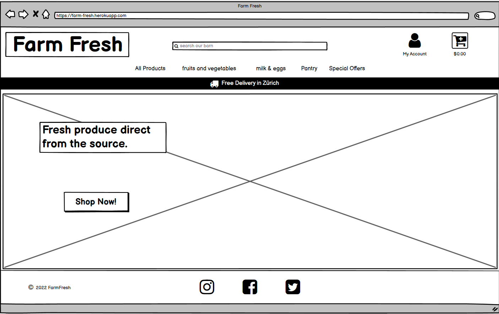
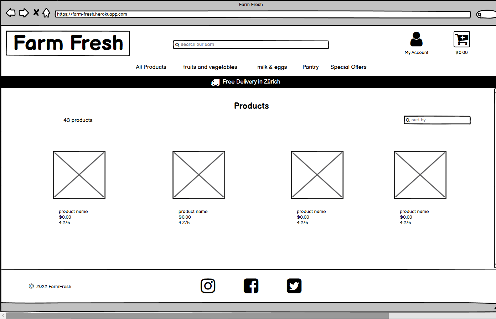
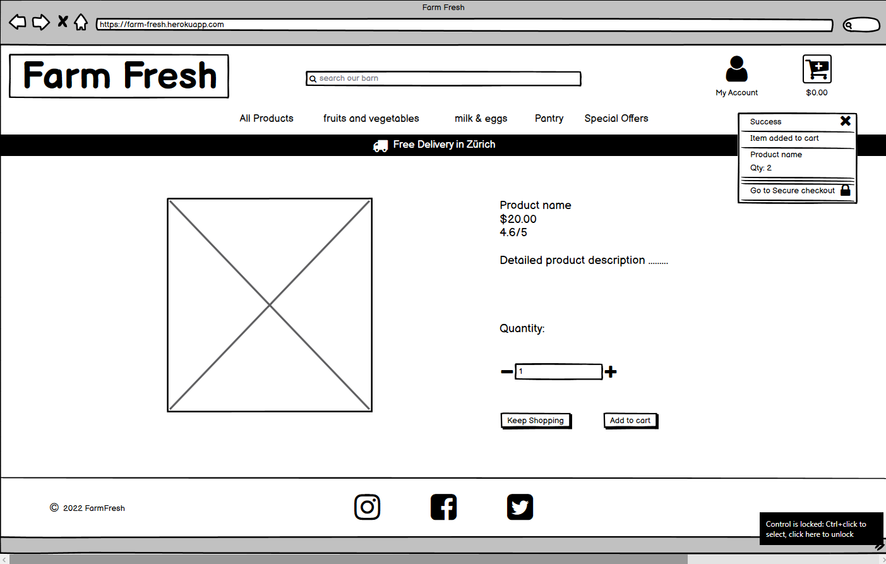
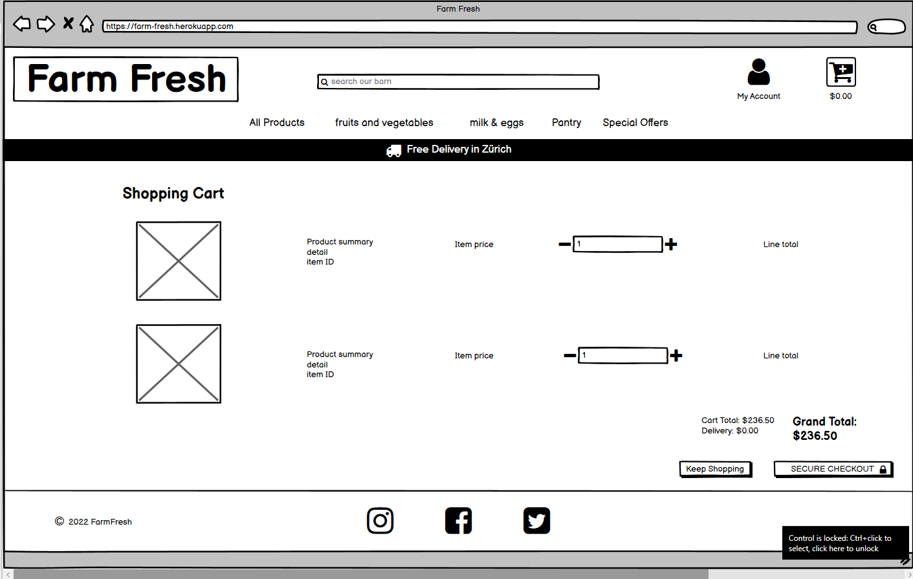
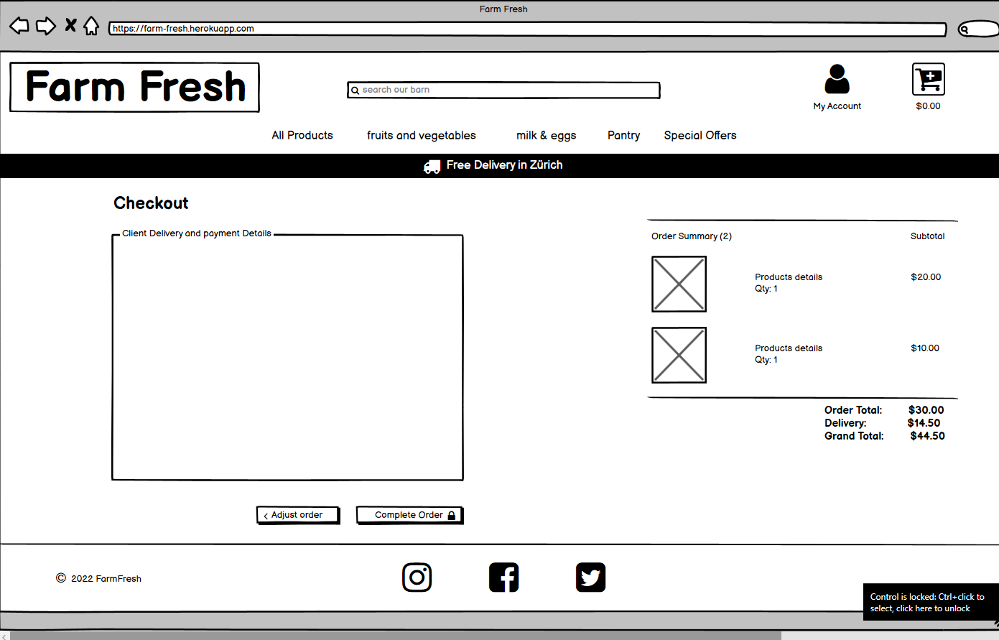
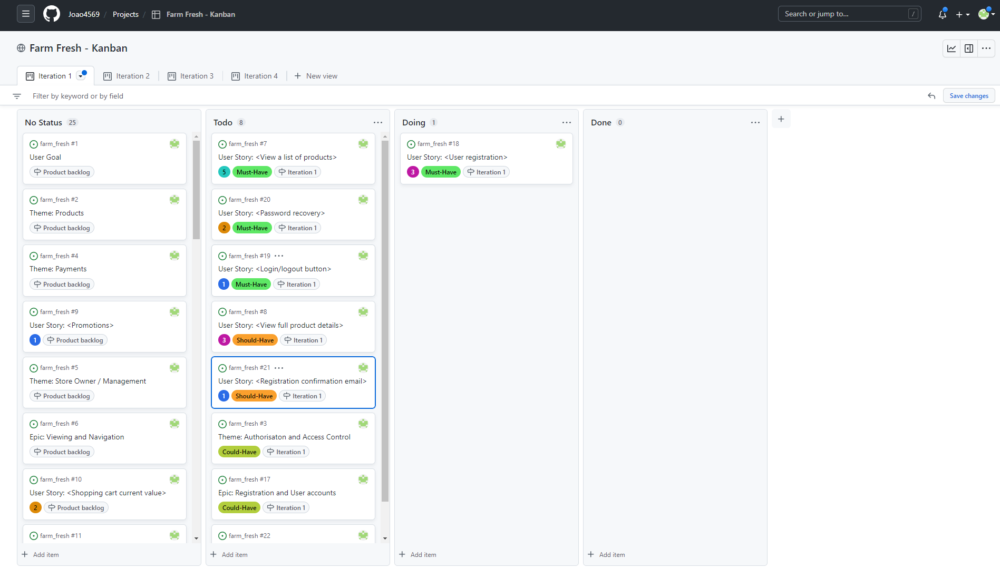
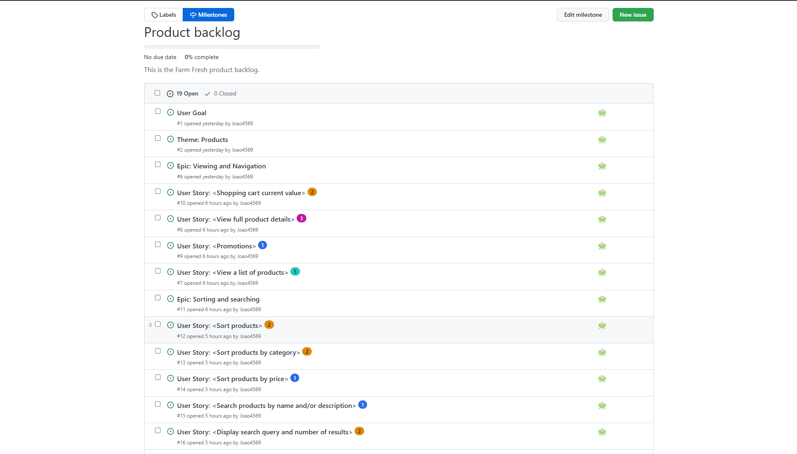
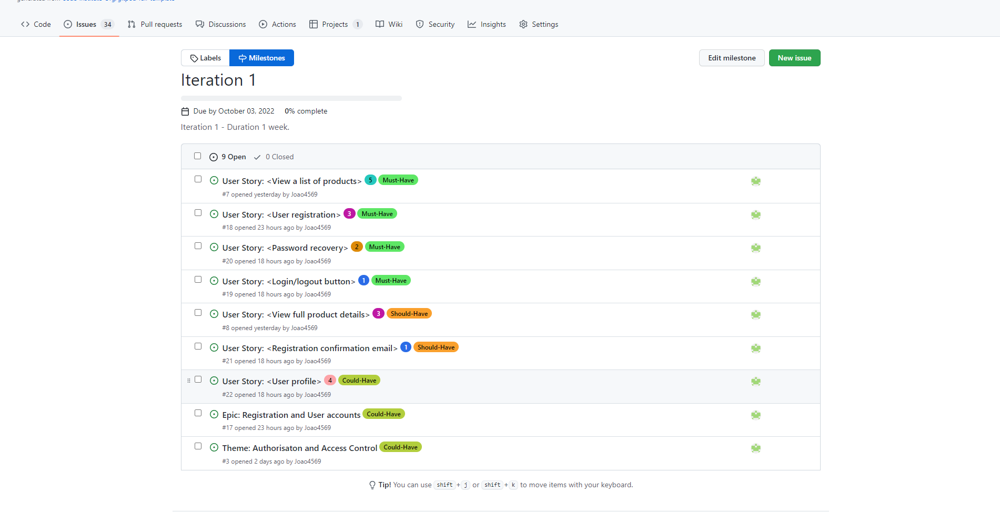
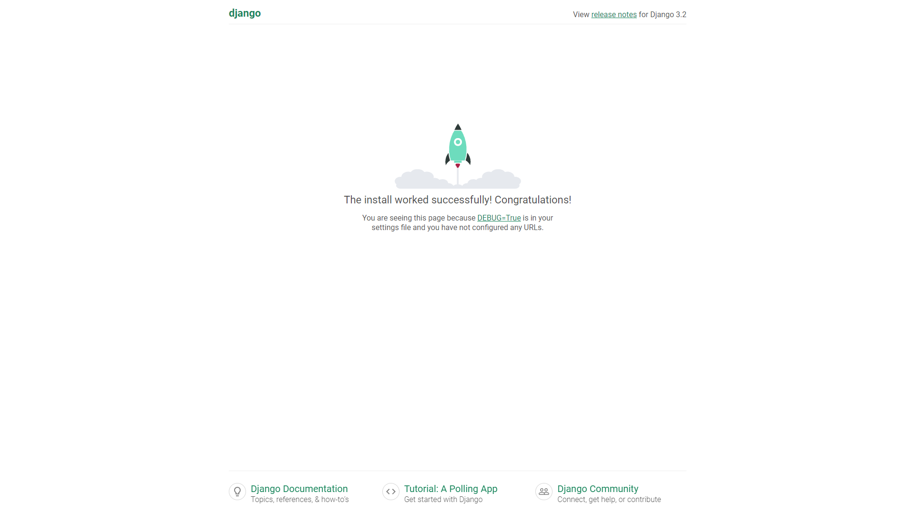

# Farm Fresh

## Introduction

## Table of Contents

* [Conception](#Conception)
  * [Project Scope](#Project-Scope)
  * [Basic Wireframe Design](#Basic-Wireframe-Design)
  * [Agile](#Agile)

* [Project Setup](#Project-Setup)
  * [Installing Django and supporting libraries](#Installing-Django-and-supporting-libraries)
  * [Create new Django project and app](#Create-new-Django-project-and-app)
  * [Django Allauth](#django-allauth)
    * [Required Django Allauth settings](#required-django-allauth-settings)
  * [Deployment on Heroku](#Deployment-on-Heroku)
    * [Steps to create Heroku App](#Steps-to-create-Heroku-App)
    * [Setting up Config Vars](#Setting-up-Config-Vars)
    * [Wiring up the Database](#Wiring-up-the-Database)
    * [Cloudinary Setup](Cloudinary-Setup)
    * [Deployment](#Deployment)

* [Deployment Testing](#Deployment-Testing)

* [Features - Existing Features](#features---existing-features)

* [MVT Architecture](#MVT-Architecture)
  * [Models](#Models)
  * [Views](#Views)
  * [Templates](#Templates)

* [Access Control](#Access-Control)

* [Features - Features Left To Implement](#features---features-left-to-impliment)

* [Testing](#Testing)
  * [Manual Testing](#Manual-Testing)
  * [Validator Testing](#Validator-Testing)
    * [Initial Validator Tests](#Initial-Validator-Tests)
    * [Final Validator Tests](#Final-Validator-Tests)
  * [Bugs Found](#bugs-found)
  * [Unfixed Bugs](#Unfixed-Bugs)

* [Credits](#Credits)
  * [Content](#Content)
  * [Media](#media)

## Conception

My thinking was that given the requirements of the project, it would be very beneficial to formulate some kind of plan which would lay out the basic scope and design of my project in order to have some kind of structure with which to work with in order to avoid missing any crucial steps during construction and make the whole construction process as efficient as possible.

I made use of the following resources in order to plan and visualise my project, named Farm Fresh:
 - I made use of [Lucidchart](https://www.lucidchart.com/pages/) to design flowcharts in order to visualise the scope of my ideas and thought processes.
 - I also made use [Lucidchart](https://www.lucidchart.com/pages/) to plan my use of Agile methodology and common practices, taught to me by Code Institute.
 - [Lucidchart](https://www.lucidchart.com/pages/) has a ERD diagram template which I used to plan Ocean Basket's model.
 - I made use of [Balsamiq](https://balsamiq.com/) in order to create a basic wireframe design for Ocean Basket's webpages.

### Project Scope

### Basic Wireframe Design

Once I had the basic scope and logic in place, I then proceeded to design a visual representation of what is needed for the basic functionality of the project from a user's point of view and how I would represent that.

#### Landing Page Wireframe

#### Products Page Wireframe

#### Products Detail Page Wireframe

#### Shopping Cart Wireframe

#### Checkout Page Wireframe

### Agile

I made use of agile common practises as described in the Code Institute tutorials. I did my best to come up with a complete layout of my agile plan from the get go but will make decisions in logical stages and update my diagrams and processes as the project develops, while documenting everything as the build progressed.

This is how I approached the challenge:

1. After reading the project requirements and the User's goal for the project idea that I had selected, I came up with the project's user goal, themes and epics.
2. From the epic's I derived the various user stories and built on this as the project developed.
3. Once I had created some user stories, I then came up with the relevant tasks for each user story.
4. After creating some stucture and scope for how to approach the task at hand, I started recording all my processes on Github:
    - I created user story templates on Github for efficiency in the Agile process.
    - I made use of Github issues to create and manage my user stories and for future defects if they arise.
    - I also came up with user story acceptance criteria which I added to the user stories on Github issues.
    - I allocated each user story with user story points, just as good practice.
    - A product backlog was also created using Github milestones, and managed throughout the development of the project in order to structure my development process.
    - As the build developed I would make refinements to the backlog.
    - I also created an iteration milestone on Github for use in this project as a timebox.
    - I made use of MoSCow prioritization by creating labels on Github and allocating them to the relevant user stories.
    - I created a Kanban board for use as an information radiator in this project by using "projects" on Github.

#### Kanban Example

#### Product Backlog Example

#### Moscow Prioritisation Example

## Project Setup

After completing the basic conception of my idea and designing some basic structure to it, I then proceeded to setting up my IDE for the project using the steps recommended by Code Institute, namely:
1. Install Django
2. Create new Django project
3. Install Django Allauth
4. Create a `requirements.txt` file
5. Create a directory for storing all of the required and customised Django allauth templates.
6. Create the MVT Architecture for Farm Fresh.

### Worth Noting:

#### Installing Django and supporting libraries

1. Install Django version 3.2 which is the Long Term Support version of Django and recommended by Code Institute for the use on our projects.
**Note** - I changed the version of Django from 3.2 to 3.0.1 as I was having issues logging in to the admin site after installing Django allauth version 0.41.0. The Code institute tutorial specified to install Django 3.2 with Django allauth 0.41.0 but in the requirements.txt file for the tutorial it is specified as Django 3.0.1 and this resolved my issues.

#### Create new Django project

1. Create new blank Django project and name it farm_fresh.
2. Migrate changes to database after creating the project
3. Test if project is working correctly.

#### Django Allauth

Opposed to building my own authentication system, allauth already has all the features I'll need for the site and it's completely customizable and will allow me to add even more functionality later on. Additionally, it's open-source so it's backed by millions of developers who keep it secure and up-to-date and it's unlikely that I would be able to create something better without a ton of extra development time.

##### Required Django Allauth settings

1. The request context processor, `'django.template.context_processors.request'`, allows allauth and django itself to access the HTTP request object in the templates, i.e. to access request.user or request.user.email in the django templates. It's required because the allauth templates use the request object frequently.
2. The authentication backend, `'allauth.account.auth_backends.AuthenticationBackend'`, in the setting.py file of the Farm Fresh project allows users to log into the store via their email address.
3. The other back-end, `'django.contrib.auth.backends.ModelBackend'` handles superusers logging into the admin which allauth doesn't handle. So I deferred to the default django Code for that.
4. The apps I added to the installed apps in the setting.py file of the Farm Fresh project, are allauth itself and these two: `'allauth.account'`, which is the allauth app that allows all the basic user account functionality like logging in and out, user registration and password resets. `'allauth.socialaccount'` which specifically handles logging in via social media providers like Facebook and Google.
5. The contrib.sites app and the site _id setting I added to the setting.py file of the Farm Fresh project, are used by the social account app to create the proper callback URLs when connecting via social media accounts.
6. I also created a path called accounts in the project level `urls.py` file and used it to include all the Django Allauth urls. I did this manually to keep everything consistent with the version of django that I have used.
7. In settings.py I added The `ACCOUNT_AUTHENTICATION_METHOD = username_email` this is what tells allauth that we want to allow authentication using either usernames or emails.
8. In settings.py, by setting `ACCOUNT_EMAIL_REQUIRED` to `True`, `ACCOUNT_EMAIL_VERIFICATION` to `mandatory` and `ACCOUNT_SIGNUP_EMAIL_ENTER_TWICE` to `True`, make it so that an email is required to register for the site. Verifying your email is mandatory so we know users are using a real email and they're going to be required to enter their email twice on the registration page to make sure that they haven't made any typos.
9. I also set a minimum username length of four characters and specified a login url and a url to redirect back to after logging in.
10. Finally create a allauth directory within the project level templates directory in order to store the customised allauth templates.

## Access Control

I have created a few users which will be helpfull for testing the project:

**Superuser**

I created a Superuser in order to access the admin functions of Django. The Superuser is also what I use to create employees, as it is now a new employee can register his or her self the same way as a customer and with the Superuser logged in, one can allocate the "is Staff" property on the admin site.

 Credentials:
   - Username: **FarmFresh**
   - Email: **joaorodrigues1@gmx.de**
   - Password: **Produce45** (case sensitive)

# Features - Existing Features

## Django Apps

### Home App

- contains the home page for Farm Fresh as index.html
- Contains the [index view](#index-view) which will display the home/landing page to the user.

### Product App

This app conatins everything needed for Farm Fresh's products, like the product models, views and URL's.

### Cart App

 - templatetags:

  - A useful trick to have in your arsenal.
For this column, the subtotal should be the quantity times the product price.
In a new folder called template tags.
I'll create a file called bag_tools.py
And I'll also create an empty file called `__init__ .py`
which will ensure that this directory is treated as a Python package
making our bag tools module available for imports and to use in templates.
Now in the bag tools file from django i'll import template.
And then create a function called calc_subtotal
Which takes in a price and a quantity as parameters and simply returns their irproduct.
Now to register this filter we need to create a variable called register.
Which is an instance of template.library
And then use the register filter decorator to register our function as a template filter.
All of this is straight from the django documentation by the way
so if you'd like a deeper explanation of how it works
just go there and look up creating custom template tags and filters.
With the filter finished all we need to do to use it is load it in the bag template with load bag tools.
Then we can pipe the price into it as the first argument.
And send the item quantity as the second.

#### Context Processor

This is Farm fresh's context processor for the shopping cart and its purpose is to make a dictionary available to all templates across the entire application much like you can use `request.user` in any template, due to the presence of the built-in request context processor.

In order to make this context processor available to the entire application I added it to the list of context processors in the templates variable in settings.py
This simple change means that anytime we need to access the cart contents in any template across the entire site they'll be available to us without having to return them from a whole bunch of different views across different apps.

Within this context processor, for convenience to the user, to let the user know how much more they need to spend in order to get a free delivery by creating a variable called `free_delivery_delta`. This way we'll be able to entice the users across the site by letting them know that they can get a free delivery if they just buy a couple more items.

#### checkout app

- Crispy  forms
- settings.py built-ins

## MVT Architecture

### Models

#### Product App

#### Category Model

This model contains the information for product categories such as it's related attributes and model methods. This model is related to the Product model and only contains the information for a category's programmatic name and an easier to read and use, friendly name..

#### Product Model

This model contains all the information for each product such as it's name, description, price, image and other related attributes such as if a product is in season or organic.

#### Producer Model

This model contains all the information for each producer such as there name, description and an image.

### Views

#### Index view

This view acts as the home/landing page for users.

#### All Products view

This view acts as the main products page for Farm Fresh. It also contains the neccessary code in order for the search bar functionality to function.

**Worth Noting**

- The object Q was imported and used in this view to generate a search query. In Django if you use `product.objects.filter()` in order to filter a list of products, like I did in this view, everything will be ended together. In the case of our queries, when a user submits a query, in order for it to match the search term it would have to appear in both the product name and the product description. Instead I wanted to return results where the query is matched in either the product name or the description. In order to accomplish this "or" logic, I needed to use Q.

 - Example of code :
   `queries = Q(name__icontains=query) | Q(description__icontains=query)`
   `products = products.filter(queries)`

 - By setting a `queries` variable equal to a Q object, where the product name contains the query or the product description contains the query, the pipe here then generates the "or" statement and the `i` in front of `contains` makes the queries case insensitive. With those queries constructed one can pass them to the filter method in order to actually filter the products.

#### Add to cart view

In modern versions of HTTP every request-response cycle between the server and the client, in my case between the django view on the server-side and our form making the request on the client-side. Uses what's called a session, to allow information to be stored until the client and server are done communicating. This is especially handy in a situation like an e-commerce store.

Because it allows us to store the contents of the shopping cart in the HTTP session while the user browses the site and adds items to be purchased.By storing the shopping bag in the session. It will persist until the user closes their browser so that they can add something to the cart. Then browse to a different part of the site add something else and so on without losing the contents of their cart. I created this view to implement this concept.

 So for a brief review:

 - The user submits the form to this view including the product id and the quantity.
 - Once in the view we'll get the cart variable if it exists in the session or create it if it doesn't.
 - Finally the item gets added to the cart or the quantity gets updated if it already exists and then the variable in the session gets overwritten with the updated  version.

### Templates

All templates folders for apps were created with inner directories matching the apps names to make sure that django knows which app these templates belong to, in case any of them end up having the same names as other templates.

#### Allauth templates

All allauth templates were copied and stored in a unique directory within the project level templates directory in order to store and customise all the required allauth templates for Farm Fresh.

#### base.html

Recommended best practises taken from Boutique Ado walkthrough project. Seperate blocks were created so that I can extend this template later on and replace segments of it as needed.

- I incorporated the use of a `http-equiv` meta tag to allow the support of older Internet Explorer versions and eliminate validation errors when validating our HTML.
- Contains all the relevant script tags needed to run Bootstrap version 4.6.
- Contains all the secmented sections of blocks so that I can extend this template later on and replace segments of it as needed.
- Contains the sites main header with logo, search bar, user related links and the link to the shopping cart.

#### Includes folder

This is commonly found in larger web projects, this gives us a place where we can create small HTML snippets and then include them in the base template using Django.

#### Mobile top header

The list items here are almost identical to the ones that exist in the header in base.html except for a few key things:
 - First you'll notice that the links in them each use the d-block and the d-lg none classes from bootstrap. This way they'll be hidden on large screens where      instead they'll show up in the top portion of the header.
 - Secondly the search form is now in a drop-down menu, instead of creating a list of links like I did for the My Account drop-down, I put a form in it instead.

All of this makes sure that the top portion of the navbar which is separate from the main navigation will display cleanly on mobile and give the user a much better UX.

#### Products Template

#### Product Detail Template

- CSRF Token used in form in order to take advantage of Django's cross-site request forgery protection. As a security precaution without this token Django won't allow you to submit the form.

#### Toasts

# Testing

## Manual Testing

- After creating the `farm_fresh` project in Gitpod, I tested it buy running the application and recieved visual confirmation that the application is working successfully from Django.

- After installing Django allauth, I manually tested logging in and out of the admin site. I found some issues but they are now all resolved and noted in the Bugs found section of this document.

- After finalising the Django allauth installation I manually went to the accounts login page and tested the authentication by redirecting a successfull login to a "success" url (which does not exist) and confirmed that it is working as expected.

- After creating the home app and index.html template with its associated view and urls, I manually tested that the template was working correctly.

- With each template created, I would manually test that they are working and displaying as intended.

- Once the initial basic products.html view was created I manually did a test to see if the context, containing products and their attributes were displaying as i expected, confirming that the views, URL's and and templates are all working as planned.

- After creating the product detail tamplate, I manually tested that all links to individual products and product images worked and that the shop now button worked as intended. All worked as expected but I found a bug, on a small mobile device the empty header container wasn't pushing the top of the page down to the bottom of the main site header, the bug and fix is recorded as bug number 4 in the [Bugs found section](#bugs-found).

- Once the logic was in place for the search bar functionality, I manually tested it by running multiple search queries with search terms that were either in the products names or descriptions and checking the results. I did not find an error with this and it is working as expected.

- After creating the shopping cart view, it's URL's and template, I then set up the links in the base.html template as well as the mobile top header template, ran the server and tested that all the links were working as planned.

- After completing the add to cart view, In order to test its functionality, I printed the shopping cart from the session in the add to cart view. By adding a couple products to the cart and checking the console I could see each products id and the quantity added.

- After adding the increment and decrementing buttons to the various pages, I manually tested and adjusted their operation for the desired functionality.

- Throughout the process of creating the shopping cart, the buttons for quantity adjustment of a product and the links for updating and removing items from the shopping cart, I extensively tested for the expected functionality and found all buttons, links and pricing functioned as I had envisioned.

- After creating the success toast, I manually added a product to the cart and tested its operation. It worked as expected.
 - Once the logic for different toasts allocated to different levels was in place, I also tested its functiionality by creating various toast allocations using my views in order to test its operation. All worked successfully.

- While checking the checkout flow by adding items to the cart, processing a test checkout payment, checking that the form is submitted and testing that the checkout_success page was working as expected, I found that the costs for the order did not appear in the order on the admin site, I suspected that the signals were not working as intended. The bug and it's fix is recorded as bug number 5 in the [Bugs found section](#bugs-found).

- I did a test log in and logout and found that the standard Allauth templates did not function well and started with their customisation thereafter.

- Once all the Allauth templates were customised, I then proceeded to test login, logout and registration by creating a new user. At the same time I also tested that the confirmation emails were functioning. I had to temporary block out the signal for the model function of the UserProfile model in order to log in with the superuser as it was created prior to the signal, this was to avoid it giving an error and to avoid having to create a new superuser. All tests were successfull.

- Once the functionality was in place for users to update their profile with new information, I tested it for the expected functionality and found it all to be in order.

- Once all the functionality was in place to test the order history and if user information is saved, if so selected by the user, I then proceeded to place an order as a authenticated user, process a test payment with test information to update the test users information. All functioned as expected and the order history is diplayed and the users information was updated and stored.

 - I also tested the order history link by clicking on the order number on the profile pages order history section and was redirected to the information of the specific order.

- Once everything was in place for the users information to be pre-filled on an order if they have the neccessary information saved, I then proceeded to test this by creating a new order and checking that the users info was in place as expected. All was in order.

- After adding the functionality to the webhook handler of the checkout app, to handle the form submision if for some reason the checkout view fails, I adjusted the Javascipt not to submit the form and tested if the webhook handler performed as expected. I found all to be in order and functioning as intended. The users order history also updated and got saved to the users profile.

- After initially creating the add product form and view, I tested its operation buy adding the url, going to the page and testing all fields. All tested well and as expected.

- I then proceeded to add product, with and without images and found that the add product functionality is working exactly as expected.

- Once all product admin functions and links were in place, I then proceeded to add, edit and delete products and found that all CRUD functionality and links were working as expected.

- When I completed the new style image field in the product admin section, I tested it by adding and editing a new test product while adding an image, removing it and changing it, and found that all was functioning as expected.

- Access control to all product admin pages was tested and functioning as expected. As a non-superuser one cannot access these pages and will be notified with an errror message displayed on screen.

### Stripe Testing

When entering an invalid card number, the numbers change to red indicating an invalid card number.

After initial installation I used the Stripe test card number and processed a payment, the form submitted and the payment was shown as successfull on the Stripe site.

**Image Placeholder**

## Validator Testing

- I Made use of the official [(Jigsaw) validator](https://jigsaw.w3.org/css-validator/) for the CSS file and the official [W3C validator](https://validator.w3.org/) for all HTML file testing.
- I made use of [PEP8 online checker](http://pep8online.com/) to validate all python code.

## Bugs found

1. While testing Django allauth I found that I did not have a matching Django and Django allauth versions in order to proceed with the project as I was taught - **RESOLVED** by uninstalling Django 3.2 and installing Django 3.0.1, then creating a new SuperUser.

2. While testing Django allauth I found this error in the terminal window: `TypeError: argument of type 'PosixPath' is not iterable`, I found a solution to the issue on [Stackoverflow](https://stackoverflow.com/questions/64634674/django-typeerror-argument-of-type-posixpath-is-not-iterable) by making use of the `os.path.join()` method on the default database name value.

3. While creating the products models and attempting to make migrations I recieved the following error from the terminla window : `(fields.E210) Cannot use ImageField because Pillow is not installed.` - **RESOLVED** by installing Pillow.

4. While testing the product detail template I found that on a small mobile device the empty header container wasn't pushing the top of the page down to the bottom of the main site header - **RESOLVED** by adding another 3 media queries in the base.css file in order to push the body down on mobile devies due to the slightly different layout used.

5. Found a bug with the checkout signals while testing the checkout flow - first I found a duplicate function name in signals.py within the checkout app, I changed this and added a print message in order to test the delete signal in the update on delete function.**RESOLVED** by finding that the signal was recieved, printed my message to the terminal and updated the orders totals. Just to make sure I then created and deleted another order, updated and modified a few line items and found it all was working as expected, including the delivery costs while I was busy testing the rest of the functionality.

6. While testing the checkout success page and the Stripe webhooks, I found an error with the form submit function in the stripe_elements.js file. I was trying to trim and collect form data which is preset in the model as well as non editable fields, and not captured on the form from the users input. **RESOLVED** by removing the code for collecting and trimming the users form input, for these 3 field: City, Country and state.

## Unfixed Bugs

None that I am aware of.

## Credits

### Media

- All flowcharts and ERD diagrams used in this project were designed by making use of [Lucidchart.com](https://www.lucidchart.com/).
- All wireframes used in this project were designed by making use of [Balsamiq.com](https://balsamiq.com/).
- Background image and all producer images used in Farm Fresh were sourced and taken from [Unsplash.com](https://unsplash.com/).
- All image files that needed to be compressed were compressed by using [TinyPNG.com](https://tinypng.com/).
- Icons used on Farm Fresh taken from [Font Awesome](https://fontawesome.com/).
- Icon class for centering Font Awesome icons taken from [Bulma CSS Framework](https://bulma.io/documentation/elements/icon/), as suggested in the Boutique Ado walkthrough project.
- All product images sourced and taken from [Farmy.ch](https://www.farmy.ch/).

### Content

 - I learned how to use `inline code blocks` in a Markdown file on [RIP Tutorial](https://riptutorial.com/markdown/example/1802/inline-code).
 - Git commit message best practices taken from [How to Write Good Commit Messages: A Practical Git Guide](https://www.freecodecamp.org/news/writing-good-commit-messages-a-practical-guide/)
 - I made extensive use of Code Institute's learning content and tutorials throughout the project for revision as well as usefull content for my readme file.
 - I made extensive use of the Django Allauth documentation for most aspects of setting up authorisation for this project.
 - Solution to issue found in terminal window while testing Django allauth sourced from [Stackoverflow.com](https://stackoverflow.com/questions/64634674/django-typeerror-argument-of-type-posixpath-is-not-iterable).
 - The Boutique Ado walkthrough project was the biggest source of information for this project and I have used many snippets of code and text from it's tutorial's, all have been commented and credited as and where required.
 - Font pairing of Signika and PT Serif sourced and taken from [Farmy.ch](https://www.farmy.ch/).
 - Method for using the model choices field attribute in the packinging model of the products app sourced from [Stackoverflow.com](https://stackoverflow.com/questions/18676156/how-to-properly-use-the-choices-field-option-in-django).
 - All product descriptions, pricing and producer content was sourced on [Farmy.ch](https://www.farmy.ch/) and modified where needed to suite its application on Farm Fresh.
 
